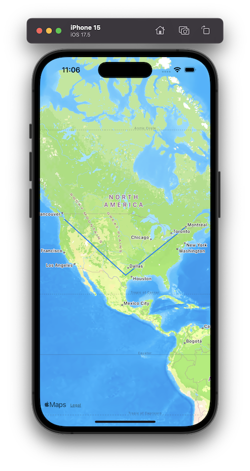
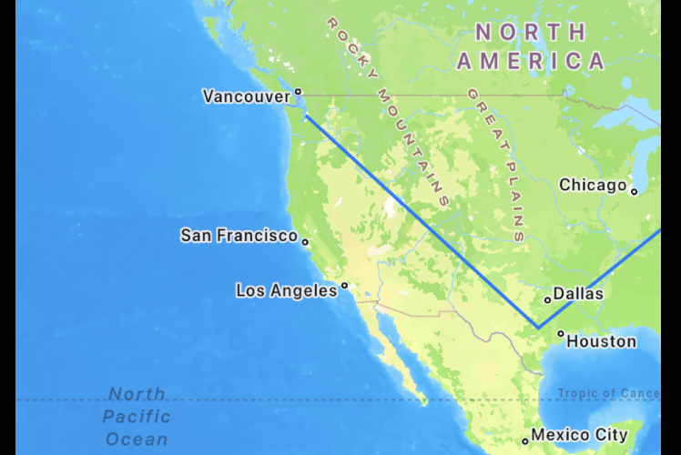
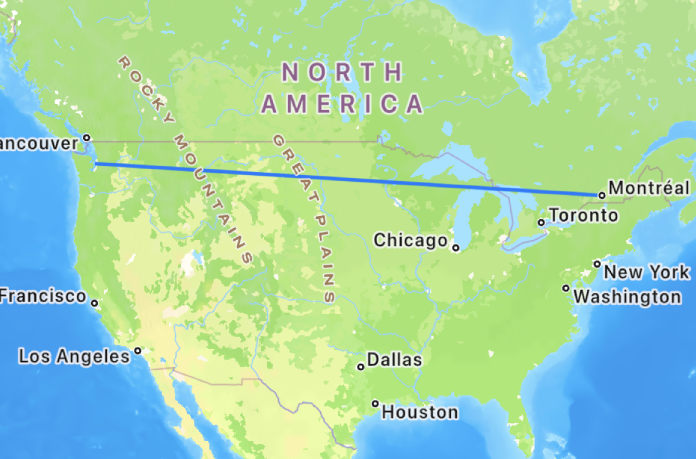
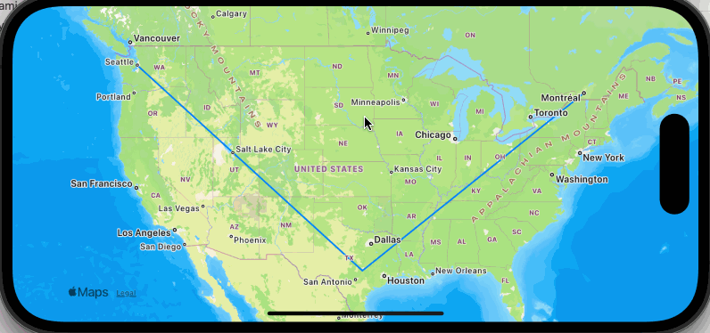

- [Context](#context)
- [Hello World](#hello-world)
- [Logging the Visible Map Region](#logging-the-visible-map-region)
- [Plotting a Polyline](#plotting-a-polyline)
- [Using Core Data](#using-core-data)
- [Filtering results with NSPredicate](#filtering-results-with-nspredicate)

## Context

I had an idea for an iOS app that would display my location history in a
visually interesting way and ran into this problem: How do I change the
`@FetchRequest`'s predicate when someone pans or zooms the map? I was
able to setup the location tracking, storing coordinates with CoreData,
but once I started loading > ~100 data points and plotting them on the
map, the app became unusably laggy. I made the app a little less laggy
by selecting all of the location coordinates and conditionally placing
them on the map, but I knew this would eventually become a problem. It
reminded me of the difference between these two Ruby on Rails
implementations:

```rb
# bad, because it selects every post and filters in the application server
@posts = Post.all.select{ |post| post.user_id == 1 }

# good, because it delegates the filtering to the database
@posts = Post.where(user_id: 1)
```

There are several answers to "How do I dynamically set the predicate for
a `@FetchRequest`", but all of the answers I could find relied on the
view making the request to adhere to the `View` protocol, and not the
`MapContent` protocol.

In this post, I'll walk through how to dynamically set the `@FetchRequest`
predicate when the map is moved.

I am using `Xcode 15.4` and `Swift 5`.

## Hello World

Create a new project in Xcode. Select `SwiftUI` as the interface and
`Core Data` as the storage values.

I deleted everything inside of `ContentView.swift`, imported `MapKit`
and added `Map` to the view, ending up with this:

```swift
import SwiftUI
import CoreData
import MapKit

struct ContentView: View {
    var body: some View {
        Map()
    }
}
```

## Logging the Visible Map Region

The [`onMapCameraChange` method](<https://developer.apple.com/documentation/swiftui/view/onmapcamerachange(frequency:_:)-9pmlq>) is invoked as the user zooms or
pans the map.

```diff
 struct ContentView: View {
     var body: some View {
-        Map()
+        Map().onMapCameraChange(frequency: .continuous) { context in
+            print(context.region)
+        }
     }
 }
```

Run and build the project, and then move the map. You'll see a bunch of
logs that look like this:

```swift
MKCoordinateRegion(
    center: __C.CLLocationCoordinate2D(
        latitude: 37.75623306438235,
        longitude: -97.1149625444021
    ),
    span: __C.MKCoordinateSpan(
        latitudeDelta: 97.2521631165165,
        longitudeDelta: 68.75137004868748
    )
)
```

So far so good, but I needed to know the bounds of the region so that
eventually I can set upper and lower limits for the latitude and
longitude in the `@FetchRequest`.

A small helper method should do the trick:

```swift
struct Bounds {
    var minLatitude: Double
    var maxLatitude: Double
    var minLongitude: Double
    var maxLongitude: Double
}

func bounds(region: MKCoordinateRegion) -> Bounds {
    return Bounds(
        minLatitude: region.center.latitude - (region.span.latitudeDelta / 2.0),
        maxLatitude: region.center.latitude + (region.span.latitudeDelta / 2.0),
        minLongitude: region.center.longitude - (region.span.longitudeDelta / 2.0),
        maxLongitude: region.center.longitude + (region.span.longitudeDelta / 2.0)
    )
}
```

and

```diff
-            print(context.region.)
+            print(bounds(region: context.region))
```

I did a quick check by moving the map towards known values (the
equator's latitude is zero, any latitude above is positive, and any
latitude below is negative).

## Plotting a Polyline

```diff
 struct ContentView: View {
     var body: some View {
-        Map().onMapCameraChange(frequency: .continuous) { context in
+        Map(){
+            MapPolyline(coordinates: [
+                // Montreal
+                CLLocationCoordinate2D(latitude: 45.5019, longitude: -73.5674),
+                // Austin
+                CLLocationCoordinate2D(latitude: 30.2672, longitude: -97.7431),
+                // Seattle
+                CLLocationCoordinate2D(latitude: 47.6061, longitude: -122.3328),
+            ]).stroke(.blue, lineWidth: 2.0)
+        }.onMapCameraChange(frequency: .continuous) { context in
             print(bounds(region: context.region))
         }
     }
```



I chose to draw a polyline on the map so that when one of the points is
out of the map's view, the line will (eventually) not extend out beyond
the visible map. See how Montreal is currently out of the view, but the
point is still in the polyline?



We'll soon fix this, but need to retrieve the points using Core Data first.

## Using Core Data

The original Xcode generated project had the `FetchRequest` property
wrapper on the main `ContentView`:

```swift
struct ContentView: View {
    @Environment(\.managedObjectContext) private var viewContext

    @FetchRequest(
        sortDescriptors: [NSSortDescriptor(keyPath: \Item.timestamp, ascending: true)],
        animation: .default)
    private var items: FetchedResults<Item>
```

Because the map's movement should determine the predicate, we have to
fetch the results on a subview that can be embedded within `Map(){...}`.

Let's move the existing `PolyLine` to its own view:

```swift
struct PolylineView: MapContent {
    var body: some MapContent {
        MapPolyline(coordinates: [
            // Montreal
            CLLocationCoordinate2D(latitude: 45.5019, longitude: -73.5674),
            // Austin
            CLLocationCoordinate2D(latitude: 30.2672, longitude: -97.7431),
            // Seattle
            CLLocationCoordinate2D(latitude: 47.6061, longitude: -122.3328),
        ]).stroke(.blue, lineWidth: 2.0)
    }
}
```

and

```diff
 struct ContentView: View {
     var body: some View {
         Map(){
-            MapPolyline(coordinates: [
-                // Montreal
-                CLLocationCoordinate2D(latitude: 45.5019, longitude: -73.5674),
-                // Austin
-                CLLocationCoordinate2D(latitude: 30.2672, longitude: -97.7431),
-                // Seattle
-                CLLocationCoordinate2D(latitude: 47.6061, longitude: -122.3328),
-            ]).stroke(.blue, lineWidth: 2.0)
+            PolylineView()
         }.onMapCameraChange(frequency: .continuous) { context in
             print(bounds(region: context.region))
         }
```

How do I get those coordinates into Core Data? In my own app, I am
inserting coordinates in the background using `CLLocationManager`, but I
wanted to include something useful for this demo.

I am much more familiar with SQL than I am swift, so I selected
`Product` > `Scheme` > `Edit Scheme...` and added the two following
options under the "Arguments Passed on Launch" section:

```
-com.apple.CoreData.SQLDebug 1
-com.apple.CoreData.Logging.stderr 1
```

Re-building the app now shows me where the sqlite file is on disk in the logs:

```
CoreData: annotation: Connecting to sqlite database file at "/Users/jesse/Library/Developer/CoreSimulator/Devices/CFF7FA30-3B35-464A-96D1-20FC28675F23/data/Containers/Data/Application/5AF02136-1634-4479-8C3A-32B7A654A27D/Library/Application Support/dynamic_map_fetch_request.sqlite"
```

and now I can open a sqlite prompt:

```
$ sqlite3 "/Users/jesse/Library/Developer/CoreSimulator/Devices/CFF7FA30-3B35-464A-96D1-20FC28675F23/data/Containers/Data/Application/5AF02136-1634-4479-8C3A-32B7A654A27D/Library/Application Support/dynamic_map_fetch_request.sqlite"

SQLite version 3.43.2 2023-10-10 13:08:14
Enter ".help" for usage hints.
sqlite>
```

Delete everything:

```
sqlite> DELETE FROM ZITEM;
```

And add our coordinates:

```sql
INSERT INTO ZITEM (ZLATITUDE, ZLONGITUDE)
VALUES
(45.5019, -73.5674),
(30.2672, -97.7431),
(47.6061, -122.3328);
```

Nice! Now let's modify the `PolylineView` to retrieve those coordinates
from Core Data.

```swift
struct PolylineView: MapContent {
    @FetchRequest var fetchRequest: FetchedResults<Item>

    init(){
        _fetchRequest = FetchRequest<Item>(sortDescriptors: [])
    }

    var body: some MapContent {
        let coordinates = fetchRequest.map { item in
            CLLocationCoordinate2D(
                latitude: item.latitude,
                longitude: item.longitude
            )
        }
        MapPolyline(coordinates: coordinates).stroke(.blue, lineWidth: 2.0)
    }
}
```

## Filtering results with NSPredicate

Just to make sure we can filter items, add an `NSPredicate` to the
`FetchRequest` and make sure only two points appear for the polyline:

```diff
     init(){
-        _fetchRequest = FetchRequest<Item>(sortDescriptors: [])
+        _fetchRequest = FetchRequest<Item>(
+            sortDescriptors: [],
+            predicate: NSPredicate(
+                format: "latitude > %f",
+                40.0
+            )
+        )
     }
```



Nice! The last part of this functionality is passing the `region` into
the `PolylineView` when the map moves, and updating the `NSPredicate`
to filter based on the min and max latitude and longitude values.

Pass the region into the polyline view:

```diff
+    @State var region: MKCoordinateRegion?;
     var body: some View {
         Map(){
-            PolylineView()
+            PolylineView(region: region)
         }.onMapCameraChange(frequency: .continuous) { context in
-            print(bounds(region: context.region))
+            region = context.region
         }
     }
 }
```

and modify the constructor to take a `region` argument:

```swift
init(region: MKCoordinateRegion?){
    if region != nil {
        let regionBounds = bounds(region: region!)
        _fetchRequest = FetchRequest<Item>(
            sortDescriptors: [],
            predicate: NSPredicate(
                format: "latitude > %f AND latitude < %f AND longitude > %f AND longitude < %f",
                regionBounds.minLatitude,
                regionBounds.maxLatitude,
                regionBounds.minLongitude,
                regionBounds.maxLongitude
            )
        )
    } else {
        // fetch nothing (the region is not yet defined)
        _fetchRequest = FetchRequest<Item>(
            sortDescriptors: [],
            predicate: NSPredicate(
                    format: "latitude = %f",
                    -200.0
            )
        )
    }
}
```

And now when I move the map, only coordinates that are within the map's
visible are are selected:



Here is the entire `ContentView.swift`:

```swift
import SwiftUI
import CoreData
import MapKit

struct PolylineView: MapContent {
    @FetchRequest var fetchRequest: FetchedResults<Item>

    init(region: MKCoordinateRegion?){
        if region != nil {
            let regionBounds = bounds(region: region!)
            _fetchRequest = FetchRequest<Item>(
                sortDescriptors: [],
                predicate: NSPredicate(
                    format: "latitude > %f AND latitude < %f AND longitude > %f AND longitude < %f",
                    regionBounds.minLatitude,
                    regionBounds.maxLatitude,
                    regionBounds.minLongitude,
                    regionBounds.maxLongitude
                )
            )
        } else {
            // fetch nothing
            _fetchRequest = FetchRequest<Item>(
                sortDescriptors: [],
                predicate: NSPredicate(
                    format: "latitude = %f",
                    -200.0
                )
            )
        }
    }

    var body: some MapContent {
        let coordinates = fetchRequest.map { item in
                    CLLocationCoordinate2D(latitude: item.latitude, longitude: item.longitude)
        }
        MapPolyline(coordinates: coordinates).stroke(.blue, lineWidth: 2.0)
    }
}

struct ContentView: View {
    @State var region: MKCoordinateRegion?;
    var body: some View {
        Map(){
            PolylineView(region: region)
        }.onMapCameraChange(frequency: .continuous) { context in
            region = context.region
        }
    }
}

struct Bounds {
    var minLatitude: Double
    var maxLatitude: Double
    var minLongitude: Double
    var maxLongitude: Double
}

func bounds(region: MKCoordinateRegion) -> Bounds {
    return Bounds(
        minLatitude: region.center.latitude - (region.span.latitudeDelta / 2.0),
        maxLatitude: region.center.latitude + (region.span.latitudeDelta / 2.0),
        minLongitude: region.center.longitude - (region.span.longitudeDelta / 2.0),
        maxLongitude: region.center.longitude + (region.span.longitudeDelta / 2.0)
    )
}
```
